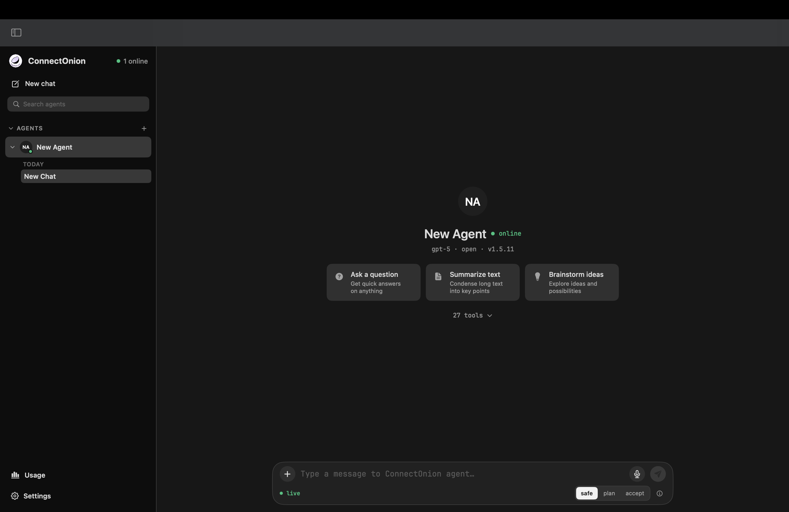
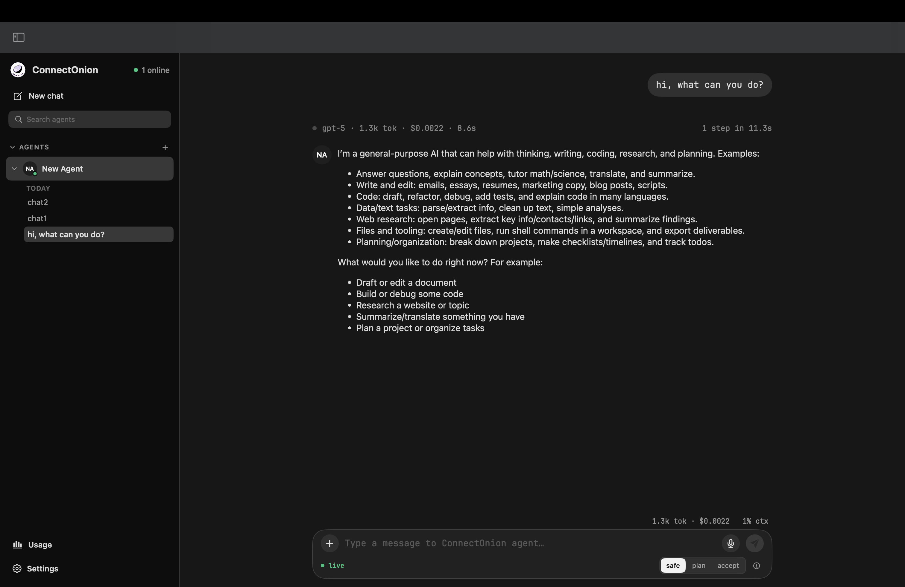
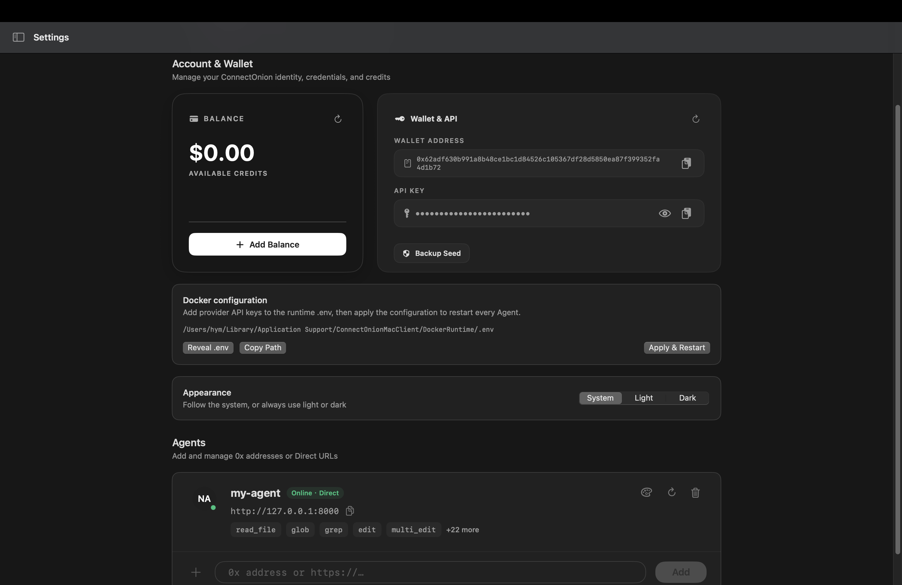
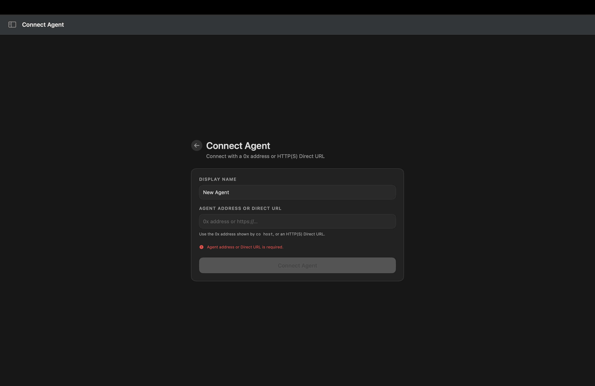
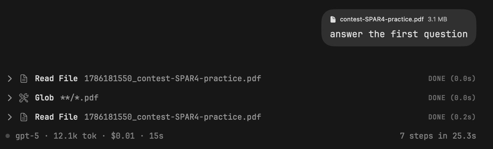

# oochat for macOS

[](https://github.com/openonion/oochat-macos/actions/workflows/ci.yml)

Native SwiftUI desktop client for [ConnectOnion](https://docs.connectonion.com/)
agents. Connect to an agent by its `0x…` address and talk to it — the same
protocol the [web client](https://github.com/openonion/oo-chat) speaks — or let
the app run an agent for you locally in Docker.



## Who this is for

This is a starting point, not a finished product you are meant to use as-is.

If you are running ConnectOnion agents and your users want a native macOS app
rather than a browser tab, fork this, change the four things under
[Make it yours](#make-it-yours), and ship it. The web client is the default
answer; this exists for when the default is not enough.

## What it does

- Connect by `0x…` address or direct URL, with address normalisation and a
  `GET /info` check before the app claims it is connected
- Streamed replies with live execution traces — you see which tool is running
  and how long it took, not just a spinner
- Markdown, code and math rendering, with per-message usage footers
- Multiple sessions per agent, kept on device, with rename and delete
- Saved agent configurations
- Ed25519 identity generated on first launch, written owner-only (`0600`)
- File attachments and voice input in the composer
- Cooperative interrupt: stop a run that is already streaming
- Reconnection with session recovery after a network drop
- System light/dark, keyboard shortcuts, drag-and-drop

| | |
| --- | --- |
| <br>**Streaming status** — rendering, per-message stats, multi-session sidebar. | <br>**Settings** — credits, key handling, Docker runtime, appearance, saved agents. |
| <br>**Connecting** — by `0x` address or direct URL, with guided failure states. | <br>**Attachments** — tool steps stream live with timings. |

### The local agent

Unlike the web client, this app can manage an agent for you. Opening it starts a
Docker Compose project running a ConnectOnion agent on your own machine; closing
the last window stops it. Identity and workspace live in named Docker volumes and
survive restarts and image upgrades.

Only the loopback endpoint is published to macOS — the local agent is not
reachable from other machines. Remote agents you add by address or direct URL are
ordinary network connections and have nothing to do with this.

If you only ever connect to remote agents, Docker is optional.

### What it does not do

- No iOS or iPad build — see the sibling clients for those platforms
- The local-agent feature needs Docker; without it, remote agents still work
- Identity is stored as an owner-only file rather than in the macOS Keychain.
  That is deliberate — it keeps key handling identical across our clients — but
  it means the key is protected by file permissions, not by the Secure Enclave

## Requirements

| | |
|---|---|
| macOS | 15.7 or later |
| Xcode | 16 or later (the project is `objectVersion 77`) |
| Docker | Only for the local-agent feature |
| An agent | See [connectonion](https://github.com/openonion/connectonion) — `pip install connectonion`, then `co init` |

## Build and run

```sh
git clone https://github.com/openonion/oochat-macos.git
cd oochat-macos
open ConnectOnionMacClient.xcodeproj
```

Build and run the `ConnectOnionMacClient` scheme, or from the command line:

```sh
xcodebuild -project ConnectOnionMacClient.xcodeproj \
           -scheme ConnectOnionMacClient \
           -configuration Release build
```

## Configure

| What | Where | Default |
|---|---|---|
| Remote agent endpoint | In-app, per saved agent | — |
| Local agent port | `docker-compose.yml` | `127.0.0.1:8000` |
| Identity key | `~/Library/Application Support/ai.openonion.oochat.macos/` | generated on first launch |

The local-agent discovery target is compiled in under `#if DEBUG` only; release
builds never poll for it.

## Make it yours

| # | What | Where |
|---|---|---|
| 1 | Bundle identifier | `ConnectOnionMacClient.xcodeproj/project.pbxproj` — currently `ai.openonion.oochat.macos` |
| 2 | Display name | `ConnectOnionMacClient/Info.plist` |
| 3 | Icon | `Onion.xcassets` |
| 4 | Application Support directory | `Networking/ConnectOnionIdentityStore.swift`, `Services/UsageStore.swift` |

## Architecture

SwiftUI views over view models over a protocol client. `Views/` renders,
`ViewModels/` holds session and connection state, `Networking/` owns the wire
protocol and the Ed25519 identity, `Services/` covers usage accounting and the
Docker runtime. The Python side (`host_agent.py`, `docker/`) is the local agent
the app manages; it is not part of the client itself.

## Documentation

| Document | Contents |
|---|---|
| [Installation Manual](docs/installation-manual.md) | Install, build, launch, troubleshooting |
| [Guide for Experienced Users](docs/user-guide-experienced.md) | Full walkthrough including credits, keys and tests |
| [Run Guide](docs/team-guide.md) | Build, run, logs, test — the day-to-day commands |
| [Robustness Testing](docs/robustness-testing.md) | Failure matrix, invariants, and where the live-model boundary sits |

## Tests

291 automated tests — 223 Swift, 68 Python — with 86.8% line coverage on the
client and 88% branch coverage on the agent runtime.

```sh
xcodebuild test -project ConnectOnionMacClient.xcodeproj -scheme ConnectOnionMacClient
pytest
```

## Contributing

Issues and pull requests are welcome at
<https://github.com/openonion/oochat-macos>.

## License

MIT — see [LICENSE](LICENSE).

Copyright (c) 2026 ConnectOnion PTY LTD.
